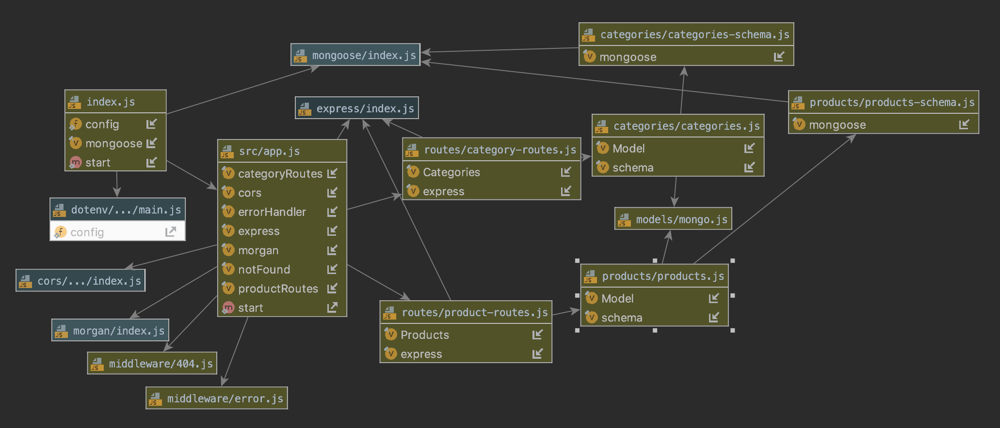

# LAB - 08

## # LAB - Express Routing & Connected API

### Author: Austin Hedeen

### Links and Resources
* [submission PR](https://github.com/austinhedeen-401-advanced-javascript/lab-08/pull/1)
* [travis](https://travis-ci.org/austinhedeen-401-advanced-javascript/lab-08/pull_requests)
* [deployment](https://serene-gorge-98085.herokuapp.com/)

### Modules
#### `app.js`
##### Exported Values and Methods

###### `server`
The Express application (for testing)

###### `start(port)`
Starts the Express server on `port`

### Setup
#### `.env` requirements
* `PORT` - Port Number
* `MONGODB_URI` - URL to the running mongo instance/db

#### Running the app
* `npm start`
* Endpoint: `/api-docs`
  * Renders API Documentation
* Endpoint: `/docs`
  * Renders Developer Documentation
* Endpoint: `/api/v1/categories/`
  * GET: Fetch all Categories
  * POST: Create a Category
* Endpoint: `/api/v1/categories/:id`
  * PUT: Update a Category
  * DELETE: Delete a Category
* Endpoint: `/api/v1/products/`
  * GET: Fetch all Products
  * POST: Create a Product
* Endpoint: `/api/v1/products/:id`
  * PUT: Update a Product
  * DELETE: Delete a Product
  
#### Tests
* `npm test`

#### UML

